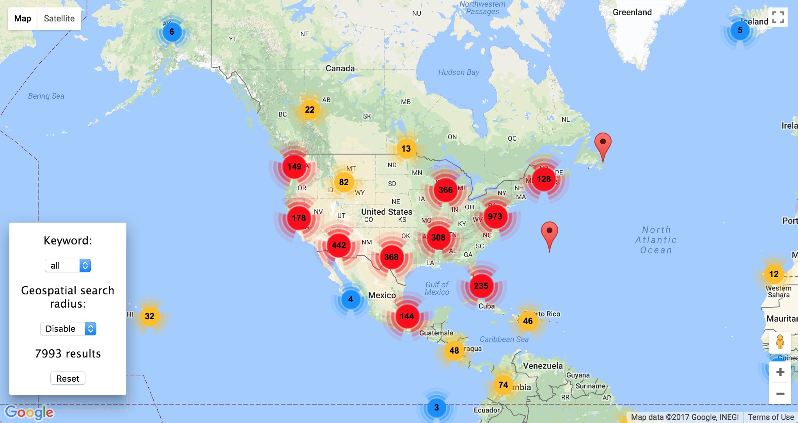

# TwittMap

[Link](http://twittmap-env.etjvjrbft2.us-west-1.elasticbeanstalk.com/)

TwittMap is Assignment 1 for COMS 6998-Cloud Computing and Big Data. We use Tweepy for streaming the real-time tweet, store them into AWS ElasticSearch. The back-end server is Flask on AWS Elastic Beanstalk.

## Environment Variables

Please set up your environment variables before deploying:

- "twitt_api_key": Consumer Key (API Key)
- "twitt_api_secret": Consumer Secret (API Secret)
- "twitt_token_key": Access Token
- "twitt_token_secret": Access Token Secret
- "aws_key": AWS User Access key ID
- "aws_secret": AWS User Access key Secret Token
- "aws_region": AWS Elasticsearch Region
- "es_host": Elasticsearch Host Address

## Architecture
- streamer.py Using Tweepy to stream real-time tweet into Elastic Search
- application.py The main server program using Flask to search tweets in Elastic Search
- static/index.html The homepage html file of this project
- static/javascript/script.js Javascript file to manipulate with Google Map api